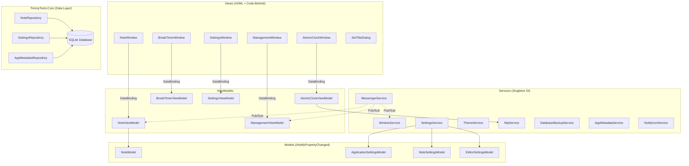
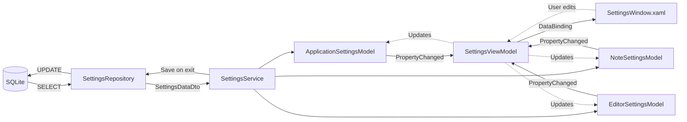
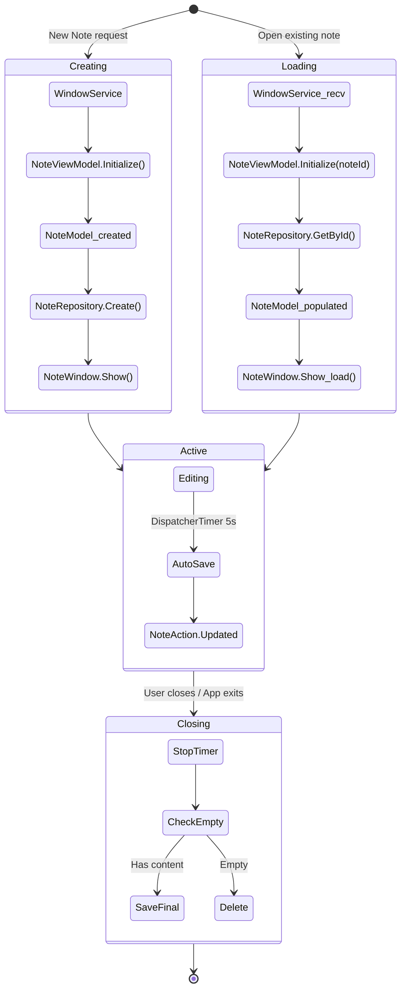

# Timmy Tools

[](https://www.gnu.org/licenses/old-licenses/gpl-2.0.en.html)
[](https://github.com/timothywarner-org/TimmyTools)
[](https://dotnet.microsoft.com/)

**Timmy Tools** is Tim Warner's teaching sidecar app -- a Windows desktop utility designed to run alongside his technical training courses. What started as a sticky notes application has grown into a multi-tool suite that includes persistent rich-text sticky notes with formatting tools, an NTP-synced atomic clock, and a configurable break timer for pacing training sessions.

Built with WPF and .NET 10.0, Timmy Tools keeps everything you need during a live training session one click away.

---

## Table of Contents

- [Tools Overview](#tools-overview)
- [Sticky Notes Features](#sticky-notes-features)
- [Context Menu Tools](#context-menu-tools)
- [Installation](#installation)
- [Building from Source](#building-from-source)
- [Project Structure](#project-structure)
- [Architecture](#architecture)
  - [High-Level Architecture](#high-level-architecture)
  - [Settings Pipeline](#settings-pipeline)
  - [Note Lifecycle](#note-lifecycle)
- [Technical Details](#technical-details)
- [Attribution](#attribution)
- [License](#license)

---

## Tools Overview

Timmy Tools includes three integrated utilities, all accessible from the system tray:

### Sticky Notes

Pin-to-top rich-text notes with auto-save, color themes, dark mode, transparency, and a full formatting context menu. Manage multiple notes across monitors with a local SQLite database backing everything.

### Atomic Clock

An NTP-synced time display window that shows the precise current time, synchronized with internet time servers. Useful for keeping training sessions on schedule and coordinating across time zones.

### Break Timer

A configurable countdown timer (egg timer) for pacing training breaks. Set the duration, start the countdown, and get a clear visual indicator when break time is over.

---

## Sticky Notes Features

### Note Management

- **Pin / Always on Top** -- Keep notes visible above all other windows.
- **Auto Save** -- Notes are automatically saved on a 5-second interval and on close.
- **Note Titles** -- Assign titles to notes for easy identification.
- **Block Minimizing** -- Prevent notes from being minimized, even with Show Desktop.
- **Lock Text** -- Make a note read-only to prevent accidental edits.

### Appearance

- **Color Themes** -- Choose from multiple colors or cycle through them automatically.
- **Dark Mode** -- Dark theme with color-matched accents.
- **Transparency** -- Make notes semi-transparent; optionally opaque when focused.
- **Start Position** -- Configure where on screen new notes appear (9-point grid).
- **Font Control** -- Choose from multiple font families directly in the context menu.
- **Rich Text Formatting** -- Bold, italic, underline, font size, font color, and paragraph alignment via the context menu.

### Editor

- **Spell Checking** -- Integrated spell checker.
- **Auto Indent** -- New lines automatically match the indentation of the previous line.
- **Tab Indentation** -- Indent selected text with Tab; configurable spaces vs. tabs.
- **Ends with New Line** -- Ensures notes always end with a newline.
- **Word Wrap** -- Toggle text wrapping.
- **Line/Word/Character Counts** -- View counts for selected or full text.

### Clipboard and Selection

- **Copy/Paste Trim** -- Automatically trim whitespace when copying or pasting.
- **Middle Click Paste** -- Paste clipboard contents with a middle-click.
- **Ctrl+Click Copy** -- Hold Ctrl and click to copy selected text.
- **Auto Copy** -- Automatically copy text when highlighted.
- **Configurable Copy Fallback** -- Choose behavior when no text is selected (current line, full note, or nothing).
- **Triple-Click** -- Select the current line.
- **Quadruple-Click** -- Select the full line ignoring wrapping.

### System Integration

- **System Tray Icon** -- Launch new notes or bring all notes to front from the tray.
- **Taskbar/Task Switcher Visibility** -- Show or hide notes from Taskbar and Alt+Tab.
- **Single Instance** -- Only one instance runs; launching again creates a new note in the existing instance.
- **Multi-Monitor Support** -- Full support for multiple displays via Win32 interop.
- **Portable Mode** -- Place a `portable.txt` file next to the executable to store data locally.

---

## Context Menu Tools

The right-click context menu on each note provides rich text editing and text transformation tools in a Stickies-style interface:

| Menu | Actions |
|------|---------|
| **Font** | Segoe UI, Arial, Calibri, Consolas, Courier New, Times New Roman |
| **Size** | 8, 10, 12, 14, 16, 18, 20, 24, 28, 36 |
| **Style** | Bold, Italic, Underline, Clear Formatting |
| **Case** | Lower, Upper, Title |
| **Font Color** | Black, Red, Blue, Green, Orange, Purple, Brown, Gray |
| **Paragraph** | Left/Center/Right/Justified alignment, Bullets, Numbered, Lettered lists, Tab spacing |
| **Counts** | Line count, Word count, Character count |
| **Locked** | Toggle read-only mode |

Additional context menu features include Undo/Redo, Copy/Cut/Paste, Select All, and inline spelling suggestions.

---

## Installation

> **Windows only.** Timmy Tools is built with WPF, which does not support Linux or macOS.

### Installer

1. Go to the [Releases page](https://github.com/timothywarner-org/TimmyTools/releases).
2. Download the latest `.msi` installer and run it.

### Portable

1. Download the latest `.zip` from the [Releases page](https://github.com/timothywarner-org/TimmyTools/releases).
2. Extract it anywhere and run `Timmy Tools.exe`.
3. Data is stored next to the executable (no AppData usage).

---

## Building from Source

**Prerequisites:** [.NET 10.0 SDK](https://dotnet.microsoft.com/download/dotnet/10.0) (or later)

```bash
# Clone the repository
git clone https://github.com/timothywarner-org/TimmyTools.git
cd TimmyTools

# Build the solution
dotnet build TimmyTools.sln

# Run the application
dotnet run --project TimmyTools.WpfUi

# Build a release configuration
dotnet build TimmyTools.sln -c Release
```

> **Note:** The `TimmyTools.Setup` project is a Visual Studio Installer project (`.vdproj`) and does not build from the CLI. It requires Visual Studio with the Installer Projects extension.

---

## Project Structure

```
TimmyTools/
├── TimmyTools.sln                      # Solution file (3 projects)
├── CLAUDE.md                           # AI assistant project context
├── .editorconfig                       # Code style rules (explicit types, Allman braces)
│
├── assets/                             # Repository assets
│   └── icon.svg                        #   Source icon file
│
├── docs/                               # Architecture documentation
│   ├── architecture.svg                #   High-level MVVM diagram
│   ├── settings-pipeline.svg           #   Settings data flow diagram
│   └── note-lifecycle.svg              #   Note state machine diagram
│
├── TimmyTools.Core/                    # DATA LAYER (class library, net10.0)
│   ├── TimmyTools.Core.csproj          #   Depends on: Microsoft.Data.Sqlite
│   ├── DatabaseInitializer.cs          #   Creates DB schema, runs migrations
│   ├── Configurations/
│   │   └── DatabaseConfiguration.cs    #   Connection string + path resolution
│   ├── DataTransferObjects/
│   │   ├── NoteDto.cs                  #   Note data record (immutable)
│   │   ├── SettingsDataDto.cs          #   Settings data record (immutable)
│   │   └── AppMetadataDataDto.cs       #   App metadata record (immutable)
│   ├── Enums/                          #   Shared enumerations
│   │   ├── ColourMode.cs               #     Light/Dark theme mode
│   │   ├── CaseTransform.cs            #     Lower/Upper/Title case
│   │   ├── StartupPosition.cs          #     9-point screen position grid
│   │   ├── TransparencyMode.cs         #     Transparency behavior
│   │   ├── VisibilityMode.cs           #     Taskbar/task-switcher visibility
│   │   └── ...                         #     (14 enum files total)
│   ├── Migrations/                     #   Sequential schema migrations (v1-v6)
│   │   ├── _SchemaMigration.cs         #     Base migration class
│   │   ├── Schema1To2Migration.cs      #     v1 -> v2
│   │   └── ...                         #     (5 migration files, current: v6)
│   └── Repositories/
│       ├── _BaseRepository.cs          #   Shared SQLite helpers
│       ├── NoteRepository.cs           #   CRUD for notes
│       ├── SettingsRepository.cs       #   CRUD for settings
│       └── AppMetadataRepository.cs    #   CRUD for app metadata
│
├── TimmyTools.WpfUi/                   # UI LAYER (WPF executable, net10.0-windows)
│   ├── TimmyTools.WpfUi.csproj         #   Depends on: Core, H.NotifyIcon.Wpf, MS DI
│   ├── App.xaml / App.xaml.cs           #   Entry point, DI registration, single-instance
│   ├── AssemblyInfo.cs                  #   WPF theme assembly attributes
│   │
│   ├── Views/                           #   WPF Windows (XAML + code-behind)
│   │   ├── NoteWindow.xaml/.cs          #     The sticky note window
│   │   ├── AtomicClockWindow.xaml/.cs   #     NTP-synced atomic clock display
│   │   ├── BreakTimerWindow.xaml/.cs    #     Configurable countdown break timer
│   │   ├── SettingsWindow.xaml/.cs      #     Settings dialog
│   │   ├── ManagementWindow.xaml/.cs    #     Note management/list window
│   │   └── SetTitleDialog.xaml/.cs      #     Note title input dialog
│   │
│   ├── ViewModels/                      #   MVVM ViewModels
│   │   ├── _BaseViewModel.cs            #     Shared ViewModel base class
│   │   ├── NoteViewModel.cs             #     Note logic (save, close, position)
│   │   ├── AtomicClockViewModel.cs      #     Atomic clock NTP sync logic
│   │   ├── BreakTimerViewModel.cs       #     Break timer countdown logic
│   │   ├── SettingsViewModel.cs         #     Settings UI logic
│   │   └── ManagementViewModel.cs       #     Note list/management logic
│   │
│   ├── Models/                          #   Observable models (INotifyPropertyChanged)
│   │   ├── _BaseModel.cs                #     SetProperty<T> + IsSaved tracking
│   │   ├── NoteModel.cs                 #     Note state (content, position, color)
│   │   ├── NotePreviewModel.cs          #     Lightweight note preview for lists
│   │   ├── AppMetadataModel.cs          #     App metadata state
│   │   ├── ApplicationSettingsModel.cs  #     App-level settings
│   │   ├── NoteSettingsModel.cs         #     Note appearance/behavior settings
│   │   └── EditorSettingsModel.cs       #     Text editor settings
│   │
│   ├── Services/                        #   Application services (DI singletons)
│   │   ├── WindowService.cs             #     Creates/tracks windows, prevents dupes
│   │   ├── SettingsService.cs           #     Loads/saves settings via repository
│   │   ├── MessengerService.cs          #     Pub/sub typed message bus
│   │   ├── ThemeService.cs              #     Color scheme + palette management
│   │   ├── NtpService.cs               #     NTP time synchronization
│   │   ├── DatabaseBackupService.cs     #     Database backup management
│   │   ├── AppMetadataService.cs        #     App version + update check state
│   │   └── NotifyIconService.cs         #     System tray icon management
│   │
│   ├── Messages/                        #   Typed message records for pub/sub
│   │   ├── ApplicationActionMessage.cs  #     App start/close/new-instance
│   │   ├── NoteActionMessage.cs         #     Note created/updated/deleted/closed
│   │   ├── WindowActionMessage.cs       #     Generic window actions
│   │   ├── MultipleNoteWindowActionMessage.cs  # Bulk note window actions
│   │   ├── OpenNoteWindowMessage.cs     #     Request to open a note window
│   │   ├── OpenSettingsWindowMessage.cs #     Request to open settings
│   │   ├── OpenAtomicClockWindowMessage.cs  #  Request to open atomic clock
│   │   ├── OpenBreakTimerWindowMessage.cs   #  Request to open break timer
│   │   └── OpenManagementWindowMessage.cs   #  Request to open management window
│   │
│   ├── Commands/
│   │   └── RelayCommand.cs              #   ICommand implementation + generic variant
│   │
│   ├── Controls/                        #   Custom WPF controls
│   │   ├── NoteTextBoxControl.cs        #     Extended RichTextBox for notes
│   │   └── ContextMenus/
│   │       └── NoteTextBoxContextMenu.cs#     Builds Stickies-style context menu
│   │
│   ├── Helpers/                         #   Utility classes
│   │   ├── ScreenHelper.cs              #     Multi-monitor bounds calculation
│   │   ├── SystemThemeHelper.cs         #     Detect Windows light/dark theme
│   │   └── VersionHelper.cs             #     GitHub release update checking
│   │
│   ├── Interop/                         #   Win32 P/Invoke wrappers
│   │   ├── User32.cs                    #     SetWindowPos, GetWindowLongPtr, etc.
│   │   ├── Constants/                   #     GWL, HWND, SWP, WS_EX, MONITOR
│   │   └── Structures/                  #     RECT, POINT, MONITORINFO
│   │
│   ├── Themes/                          #   Color and theme management
│   │   ├── Theme.cs                     #     Theme definition
│   │   ├── DefaultTheme.cs              #     Built-in theme with color schemes
│   │   ├── ColorScheme.cs               #     Named color set
│   │   └── Palette.cs                   #     Resolved brush palette for rendering
│   │
│   └── Images/
│       ├── icon.ico                     #   Application icon
│       └── icon.png                     #   NuGet package icon
│
└── TimmyTools.Setup/                    # MSI INSTALLER (Visual Studio .vdproj)
                                         #   Does not build from CLI
```

---

## Architecture

Timmy Tools follows the **MVVM (Model-View-ViewModel)** pattern with a **pub/sub messaging** layer for decoupled communication between components. All services are registered through **Microsoft.Extensions.DependencyInjection** in `App.xaml.cs`.

### High-Level Architecture

The application is split into two projects: **TimmyTools.Core** (data layer) and **TimmyTools.WpfUi** (UI layer). Views bind to ViewModels, ViewModels communicate through `MessengerService`, and all data persistence flows through the repository pattern to SQLite.

<p align="center">
  
</p>

<details>
<summary>View Mermaid source</summary>



</details>

**Key design decisions:**

- **Singleton services** -- `WindowService`, `SettingsService`, `MessengerService`, `ThemeService`, and `NtpService` are registered as singletons to maintain shared state across the application.
- **Transient windows** -- `SettingsWindow` and `ManagementWindow` are transient so they can be created and disposed independently.
- **Message records** -- All pub/sub messages are C# `record` types in the `Messages/` folder, providing immutable, typed communication.
- **Tool windows** -- The Atomic Clock and Break Timer are standalone windows managed by `WindowService`, following the same lifecycle as other tool windows.

### Settings Pipeline

Settings flow from SQLite through the repository layer as immutable DTOs, get mapped into three observable model objects by `SettingsService`, bind to ViewModels, and render in XAML. Changes flow back through the same pipeline on application exit.

<p align="center">
  
</p>

<details>
<summary>View Mermaid source</summary>



</details>

**How it works:**

1. On startup, `SettingsService.Load()` reads a single `SettingsDataDto` record from the database.
2. Fields are mapped into three model objects (`ApplicationSettingsModel`, `NoteSettingsModel`, `EditorSettingsModel`), each implementing `INotifyPropertyChanged`.
3. ViewModels and Views bind to these models. Changes propagate via `PropertyChanged` events.
4. On exit, `SettingsService.Save()` constructs a new `SettingsDataDto` from all three models and writes it back to the database.

### Note Lifecycle

A note progresses through creation (or loading), an active editing state with periodic auto-save, and finally closing where it is either saved or deleted if empty.

<p align="center">
  
</p>

<details>
<summary>View Mermaid source</summary>



</details>

**Key behaviors:**

- **Auto-save** -- A `DispatcherTimer` fires every 5 seconds. If `IsSaved` is `false` (set automatically when any model property changes via `BaseModel.SetProperty<T>`), the note is persisted to the database.
- **Empty note cleanup** -- When a note is closed, if its content is empty, it is automatically deleted from the database rather than saved.
- **Duplicate prevention** -- `WindowService` tracks open note windows by ID. Attempting to open an already-open note activates the existing window instead of creating a duplicate.
- **Pub/sub notifications** -- Every state change publishes a `NoteActionMessage` so other components (like the management window) stay in sync.

---

## Technical Details

| Aspect | Details |
|--------|---------|
| **Framework** | .NET 10.0, WPF (Windows Presentation Foundation) |
| **Language** | C# with nullable reference types enabled |
| **Database** | SQLite via Microsoft.Data.Sqlite 10.0.3 |
| **DI Container** | Microsoft.Extensions.DependencyInjection 10.0.3 |
| **Tray Icon** | H.NotifyIcon.Wpf 2.4.1 |
| **Schema Version** | 6 (with 5 sequential migrations from v1) |
| **Data Location** | `%APPDATA%/Pinny Notes/pinny_notes.sqlite` (installed) or exe directory (portable/debug) |
| **Single Instance** | Named Mutex + EventWaitHandle with separate GUIDs for Debug/Release |
| **Win32 Interop** | P/Invoke to User32 for window positioning, always-on-top, and visibility control |

### Service Registration Summary

Configured in `App.xaml.cs`:

| Lifetime | Services |
|----------|----------|
| **Singleton** | `DatabaseConfiguration`, `SettingsRepository`, `AppMetadataRepository`, `NoteRepository`, `AppMetadataService`, `SettingsService`, `MessengerService`, `WindowService`, `ThemeService`, `DatabaseBackupService`, `NtpService` |
| **Transient** | `NotifyIconService`, `SettingsWindow`, `SettingsViewModel`, `ManagementWindow`, `ManagementViewModel`, `BreakTimerWindow`, `BreakTimerViewModel`, `AtomicClockWindow`, `AtomicClockViewModel` |

### Context Menu System

The right-click context menu is built by `NoteTextBoxContextMenu`, which constructs all submenus (Font, Size, Style, Case, Font Color, Paragraph, Counts) directly. Each submenu builder method creates `MenuItem` instances bound to commands on `NoteTextBoxControl`. The menu also includes inline spelling suggestions, undo/redo, clipboard operations, and a read-only lock toggle.

To add a new context menu item: add a builder method in `NoteTextBoxContextMenu` and register it in the `Populate()` method.

---

## Attribution

Timmy Tools builds on the work of several projects and inspirations:

- **[PinnyNotes](https://github.com/63BeetleSmurf/PinnyNotes)** by 63BeetleSmurf -- The original sticky notes application that Timmy Tools was forked from. PinnyNotes provided the core note management, text transformation tools, and MVVM architecture that form the foundation of this project.
- **Atomic Clock** -- The NTP-synced clock window was inspired by the need to display precise, server-synchronized time during live training sessions.
- **Egg Timer** -- The break timer concept draws from classic egg timer utilities, adapted here as a training break countdown for pacing course sessions.

---

## License

This project is licensed under the [GNU General Public License v2.0](https://www.gnu.org/licenses/old-licenses/gpl-2.0.en.html).
