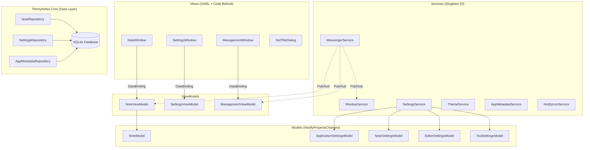
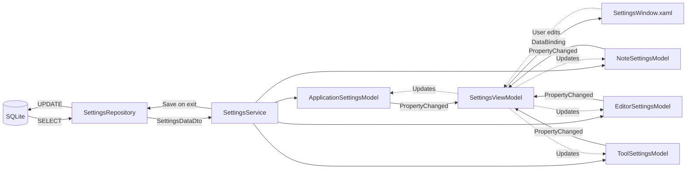
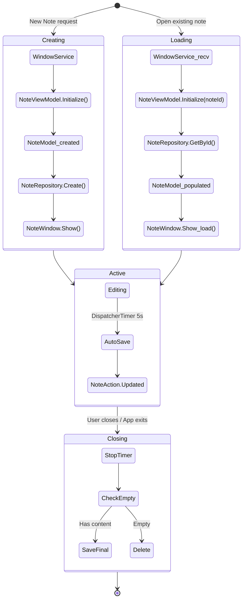

# Timmy Notes

[](https://www.gnu.org/licenses/old-licenses/gpl-2.0.en.html)
[](https://github.com/timothywarner-org/TimmyNotes)
[](https://dotnet.microsoft.com/)


**Timmy Notes** is a Windows sticky notes application built with WPF and .NET 10.0. Pin notes to stay always on top, transform text with 20 built-in tools, manage multiple notes with color themes and transparency, and persist everything in a local SQLite database. Forked from [63BeetleSmurf/TimmyNotes](https://github.com/63BeetleSmurf/TimmyNotes), with the goal of replicating and extending functionality inspired by Zhorn Software's Stickies.

---

## Table of Contents

- [Features](#features)
- [Text Transformation Tools](#text-transformation-tools)
- [Installation](#installation)
- [Building from Source](#building-from-source)
- [Project Structure](#project-structure)
- [Architecture](#architecture)
  - [High-Level Architecture](#high-level-architecture)
  - [Settings Pipeline](#settings-pipeline)
  - [Note Lifecycle](#note-lifecycle)
- [Technical Details](#technical-details)
- [License](#license)

---

## Features

### Note Management
- **Pin / Always on Top** -- Keep notes visible above all other windows.
- **Auto Save** -- Notes are automatically saved on a 5-second interval and on close.
- **Note Titles** -- Assign titles to notes for easy identification.
- **Block Minimizing** -- Prevent notes from being minimized, even with Show Desktop.
- **Lock Text** -- Make a note read-only to prevent accidental edits.

### Appearance
- **Color Themes** -- Choose from multiple colors or cycle through them automatically.
- **Dark Mode** -- Dark theme with color-matched accents.
- **Transparency** -- Make notes semi-transparent; optionally opaque when focused.
- **Start Position** -- Configure where on screen new notes appear (9-point grid).
- **Font Control** -- Choose between standard and monospace fonts.

### Editor
- **Spell Checking** -- Integrated spell checker.
- **Auto Indent** -- New lines automatically match the indentation of the previous line.
- **Tab Indentation** -- Indent selected text with Tab; configurable spaces vs. tabs.
- **Ends with New Line** -- Ensures notes always end with a newline.
- **Word Wrap** -- Toggle text wrapping.
- **Line/Word/Character Counts** -- View counts for selected or full text.

### Clipboard and Selection
- **Copy/Paste Trim** -- Automatically trim whitespace when copying or pasting.
- **Middle Click Paste** -- Paste clipboard contents with a middle-click.
- **Ctrl+Click Copy** -- Hold Ctrl and click to copy selected text.
- **Auto Copy** -- Automatically copy text when highlighted.
- **Configurable Copy Fallback** -- Choose behavior when no text is selected (current line, full note, or nothing).
- **Triple-Click** -- Select the current line.
- **Quadruple-Click** -- Select the full line ignoring wrapping.

### System Integration
- **System Tray Icon** -- Launch new notes or bring all notes to front from the tray.
- **Taskbar/Task Switcher Visibility** -- Show or hide notes from Taskbar and Alt+Tab.
- **Single Instance** -- Only one instance runs; launching again creates a new note in the existing instance.
- **Multi-Monitor Support** -- Full support for multiple displays via Win32 interop.
- **Portable Mode** -- Place a `portable.txt` file next to the executable to store data locally.

---

## Text Transformation Tools

20 built-in tools are accessible via right-click context menu on any note. Each tool can be set to Disabled, Enabled, or Favorite in settings.

| Tool | Description |
|------|-------------|
| **Base64** | Encode/decode Base64 text |
| **Bracket** | Add/remove parentheses, square brackets, or curly braces |
| **Case** | Convert to lower, upper, or proper case |
| **Color** | Convert RGB to/from HEX values |
| **DateTime** | Insert the current date in sortable format |
| **Gibberish** | Generate placeholder words, sentences, paragraphs, or names |
| **GUID** | Generate GUIDs/UUIDs |
| **Hash** | Generate MD5, SHA1, SHA256/384/512 hashes |
| **HTML Entity** | Encode/decode HTML entities |
| **Indent** | Indent all lines using 2/4 spaces or tabs |
| **Join** | Join multiple lines with commas, spaces, or tabs |
| **JSON** | Prettify JSON data |
| **List** | Add numbering/bullets, sort lines, or remove markers |
| **Quote** | Add/remove single, double, or backtick quotes |
| **Remove** | Strip whitespace, slashes, or repeated text |
| **Slash** | Toggle or remove forward/back slashes |
| **Sort** | Sort lines alphabetically or in reverse |
| **Split** | Split text by commas, tabs, spaces, or patterns |
| **Trim** | Remove leading/trailing whitespace or blank lines |
| **URL** | Encode/decode text for URLs |

---

## Installation

> **Windows only.** Timmy Notes is built with WPF, which does not support Linux or macOS.

### Installer

1. Go to the [Releases page](https://github.com/timothywarner-org/TimmyNotes/releases).
2. Download the latest `.msi` installer and run it.

### Portable

1. Download the latest `.zip` from the [Releases page](https://github.com/timothywarner-org/TimmyNotes/releases).
2. Extract it anywhere and run `Timmy Notes.exe`.
3. Data is stored next to the executable (no AppData usage).

---

## Building from Source

**Prerequisites:** [.NET 10.0 SDK](https://dotnet.microsoft.com/download/dotnet/10.0) (or later)

```bash
# Clone the repository
git clone https://github.com/timothywarner-org/TimmyNotes.git
cd TimmyNotes

# Build the solution
dotnet build TimmyNotes.sln

# Run the application
dotnet run --project TimmyNotes.WpfUi

# Build a release configuration
dotnet build TimmyNotes.sln -c Release
```

> **Note:** The `TimmyNotes.Setup` project is a Visual Studio Installer project (`.vdproj`) and does not build from the CLI. It requires Visual Studio with the Installer Projects extension.

---

## Project Structure

```
TimmyNotes/
├── TimmyNotes.sln                      # Solution file (3 projects)
├── CLAUDE.md                           # AI assistant project context
├── .editorconfig                       # Code style rules (explicit types, Allman braces)
│
├── assets/                             # Repository assets
│   ├── Screenshot.png                  #   App screenshot for README
│   └── icon.svg                        #   Source icon file
│
├── docs/                               # Architecture documentation
│   ├── architecture.svg                #   High-level MVVM diagram
│   ├── settings-pipeline.svg           #   Settings data flow diagram
│   └── note-lifecycle.svg              #   Note state machine diagram
│
├── TimmyNotes.Core/                    # DATA LAYER (class library, net10.0)
│   ├── TimmyNotes.Core.csproj          #   Depends on: Microsoft.Data.Sqlite
│   ├── DatabaseInitializer.cs          #   Creates DB schema, runs migrations
│   ├── Configurations/
│   │   └── DatabaseConfiguration.cs    #   Connection string + path resolution
│   ├── DataTransferObjects/
│   │   ├── NoteDto.cs                  #   Note data record (immutable)
│   │   ├── SettingsDataDto.cs          #   Settings data record (immutable)
│   │   └── AppMetadataDataDto.cs       #   App metadata record (immutable)
│   ├── Enums/                          #   Shared enumerations
│   │   ├── ColourMode.cs               #     Light/Dark theme mode
│   │   ├── StartupPosition.cs          #     9-point screen position grid
│   │   ├── ToolState.cs                #     Disabled/Enabled/Favourite
│   │   ├── TransparencyMode.cs         #     Transparency behavior
│   │   ├── VisibilityMode.cs           #     Taskbar/task-switcher visibility
│   │   └── ...                         #     (12 enum files total)
│   ├── Migrations/                     #   Sequential schema migrations (v1-v6)
│   │   ├── _SchemaMigration.cs         #     Base migration class
│   │   ├── Schema1To2Migration.cs      #     v1 -> v2
│   │   └── ...                         #     (5 migration files, current: v6)
│   └── Repositories/
│       ├── _BaseRepository.cs          #   Shared SQLite helpers
│       ├── NoteRepository.cs           #   CRUD for notes
│       ├── SettingsRepository.cs       #   CRUD for settings
│       └── AppMetadataRepository.cs    #   CRUD for app metadata
│
├── TimmyNotes.WpfUi/                   # UI LAYER (WPF executable, net10.0-windows)
│   ├── TimmyNotes.WpfUi.csproj         #   Depends on: Core, H.NotifyIcon.Wpf, MS DI
│   ├── App.xaml / App.xaml.cs           #   Entry point, DI registration, single-instance
│   ├── AssemblyInfo.cs                  #   WPF theme assembly attributes
│   │
│   ├── Views/                           #   WPF Windows (XAML + code-behind)
│   │   ├── NoteWindow.xaml/.cs          #     The sticky note window
│   │   ├── SettingsWindow.xaml/.cs      #     Settings dialog
│   │   ├── ManagementWindow.xaml/.cs    #     Note management/list window
│   │   └── SetTitleDialog.xaml/.cs      #     Note title input dialog
│   │
│   ├── ViewModels/                      #   MVVM ViewModels
│   │   ├── _BaseViewModel.cs            #     Shared ViewModel base class
│   │   ├── NoteViewModel.cs             #     Note logic (save, close, position)
│   │   ├── SettingsViewModel.cs         #     Settings UI logic
│   │   └── ManagementViewModel.cs       #     Note list/management logic
│   │
│   ├── Models/                          #   Observable models (INotifyPropertyChanged)
│   │   ├── _BaseModel.cs                #     SetProperty<T> + IsSaved tracking
│   │   ├── NoteModel.cs                 #     Note state (content, position, color)
│   │   ├── NotePreviewModel.cs          #     Lightweight note preview for lists
│   │   ├── ApplicationSettingsModel.cs  #     App-level settings
│   │   ├── NoteSettingsModel.cs         #     Note appearance/behavior settings
│   │   ├── EditorSettingsModel.cs       #     Text editor settings
│   │   └── ToolSettingsModel.cs         #     Per-tool enable/disable states
│   │
│   ├── Services/                        #   Application services (DI singletons)
│   │   ├── WindowService.cs             #     Creates/tracks windows, prevents dupes
│   │   ├── SettingsService.cs           #     Loads/saves settings via repository
│   │   ├── MessengerService.cs          #     Pub/sub typed message bus
│   │   ├── ThemeService.cs              #     Color scheme + palette management
│   │   ├── AppMetadataService.cs        #     App version + update check state
│   │   └── NotifyIconService.cs         #     System tray icon management
│   │
│   ├── Messages/                        #   Typed message records for pub/sub
│   │   ├── ApplicationActionMessage.cs  #     App start/close/new-instance
│   │   ├── NoteActionMessage.cs         #     Note created/updated/deleted/closed
│   │   ├── WindowActionMessage.cs       #     Generic window actions
│   │   ├── OpenNoteWindowMessage.cs     #     Request to open a note window
│   │   ├── OpenSettingsWindowMessage.cs #     Request to open settings
│   │   └── ...                          #     (7 message types total)
│   │
│   ├── Tools/                           #   20 text transformation tools
│   │   ├── _Interfaces/ITool.cs         #     Tool interface
│   │   ├── _BaseTool.cs                 #     Template Method base class
│   │   ├── _ToolMenuAction.cs           #     Menu item descriptor
│   │   ├── CaseTool.cs                  #     Lower/upper/proper case
│   │   ├── HashTool.cs                  #     MD5, SHA1, SHA256/384/512
│   │   └── ...                          #     (20 tool implementations)
│   │
│   ├── Commands/
│   │   └── RelayCommand.cs              #   ICommand implementation + generic variant
│   │
│   ├── Controls/                        #   Custom WPF controls
│   │   ├── NoteTextBoxControl.cs        #     Extended RichTextBox for notes
│   │   └── ContextMenus/
│   │       └── NoteTextBoxContextMenu.cs#     Builds context menu with tools
│   │
│   ├── Helpers/                         #   Utility classes
│   │   ├── ScreenHelper.cs              #     Multi-monitor bounds calculation
│   │   ├── SystemThemeHelper.cs         #     Detect Windows light/dark theme
│   │   └── VersionHelper.cs             #     GitHub release update checking
│   │
│   ├── Interop/                         #   Win32 P/Invoke wrappers
│   │   ├── User32.cs                    #     SetWindowPos, GetWindowLongPtr, etc.
│   │   ├── Constants/                   #     GWL, HWND, SWP, WS_EX, MONITOR
│   │   └── Structures/                  #     RECT, POINT, MONITORINFO
│   │
│   ├── Themes/                          #   Color and theme management
│   │   ├── Theme.cs                     #     Theme definition
│   │   ├── DefaultTheme.cs              #     Built-in theme with color schemes
│   │   ├── ColorScheme.cs               #     Named color set
│   │   └── Palette.cs                   #     Resolved brush palette for rendering
│   │
│   └── Images/
│       ├── icon.ico                     #   Application icon
│       └── icon.png                     #   NuGet package icon
│
└── TimmyNotes.Setup/                    # MSI INSTALLER (Visual Studio .vdproj)
                                         #   Does not build from CLI
```

---

## Architecture

Timmy Notes follows the **MVVM (Model-View-ViewModel)** pattern with a **pub/sub messaging** layer for decoupled communication between components. All services are registered through **Microsoft.Extensions.DependencyInjection** in `App.xaml.cs`.

### High-Level Architecture

The application is split into two projects: **TimmyNotes.Core** (data layer) and **TimmyNotes.WpfUi** (UI layer). Views bind to ViewModels, ViewModels communicate through `MessengerService`, and all data persistence flows through the repository pattern to SQLite.

<p align="center">
  
</p>

<details>
<summary>View Mermaid source</summary>



</details>

**Key design decisions:**
- **Singleton services** -- `WindowService`, `SettingsService`, `MessengerService`, and `ThemeService` are registered as singletons to maintain shared state across the application.
- **Transient windows** -- `SettingsWindow` and `ManagementWindow` are transient so they can be created and disposed independently.
- **Message records** -- All pub/sub messages are C# `record` types in the `Messages/` folder, providing immutable, typed communication.

### Settings Pipeline

Settings flow from SQLite through the repository layer as immutable DTOs, get mapped into four observable model objects by `SettingsService`, bind to ViewModels, and render in XAML. Changes flow back through the same pipeline on application exit.

<p align="center">
  
</p>

<details>
<summary>View Mermaid source</summary>



</details>

**How it works:**
1. On startup, `SettingsService.Load()` reads a single `SettingsDataDto` record from the database.
2. Fields are mapped into four model objects (`ApplicationSettingsModel`, `NoteSettingsModel`, `EditorSettingsModel`, `ToolSettingsModel`), each implementing `INotifyPropertyChanged`.
3. ViewModels and Views bind to these models. Changes propagate via `PropertyChanged` events.
4. On exit, `SettingsService.Save()` constructs a new `SettingsDataDto` from all four models and writes it back to the database.

### Note Lifecycle

A note progresses through creation (or loading), an active editing state with periodic auto-save, and finally closing where it is either saved or deleted if empty.

<p align="center">
  
</p>

<details>
<summary>View Mermaid source</summary>



</details>

**Key behaviors:**
- **Auto-save** -- A `DispatcherTimer` fires every 5 seconds. If `IsSaved` is `false` (set automatically when any model property changes via `BaseModel.SetProperty<T>`), the note is persisted to the database.
- **Empty note cleanup** -- When a note is closed, if its content is empty, it is automatically deleted from the database rather than saved.
- **Duplicate prevention** -- `WindowService` tracks open note windows by ID. Attempting to open an already-open note activates the existing window instead of creating a duplicate.
- **Pub/sub notifications** -- Every state change publishes a `NoteActionMessage` so other components (like the management window) stay in sync.

---

## Technical Details

| Aspect | Details |
|--------|---------|
| **Framework** | .NET 10.0, WPF (Windows Presentation Foundation) |
| **Language** | C# with nullable reference types enabled |
| **Database** | SQLite via Microsoft.Data.Sqlite 10.0.3 |
| **DI Container** | Microsoft.Extensions.DependencyInjection 10.0.3 |
| **Tray Icon** | H.NotifyIcon.Wpf 2.4.1 |
| **Schema Version** | 6 (with 5 sequential migrations from v1) |
| **Data Location** | `%APPDATA%/Pinny Notes/pinny_notes.sqlite` (installed) or exe directory (portable/debug) |
| **Single Instance** | Named Mutex + EventWaitHandle with separate GUIDs for Debug/Release |
| **Win32 Interop** | P/Invoke to User32 for window positioning, always-on-top, and visibility control |

### Service Registration Summary

Configured in `App.xaml.cs`:

| Lifetime | Services |
|----------|----------|
| **Singleton** | `DatabaseConfiguration`, `NoteRepository`, `SettingsRepository`, `AppMetadataRepository`, `AppMetadataService`, `SettingsService`, `MessengerService`, `WindowService`, `ThemeService` |
| **Transient** | `NotifyIconService`, `SettingsWindow`, `SettingsViewModel`, `ManagementWindow`, `ManagementViewModel` |

### Tools System

All 20 tools inherit from `BaseTool`, which implements the **Template Method** pattern. Each tool:
1. Calls `InitializeMenuItem()` with a header and array of `ToolMenuAction` descriptors.
2. Implements text transformation via `ApplyFunctionToNoteText()` or `ApplyFunctionToEachLine()`.
3. Is instantiated in `NoteTextBoxContextMenu` and filtered by its `ToolState` setting (Disabled, Enabled, or Favourite).

To add a new tool: create a class extending `BaseTool`, implement the menu actions, and register it in the `NoteTextBoxContextMenu` constructor's tools array.

---

## License

This project is licensed under the [GNU General Public License v2.0](https://www.gnu.org/licenses/old-licenses/gpl-2.0.en.html).
