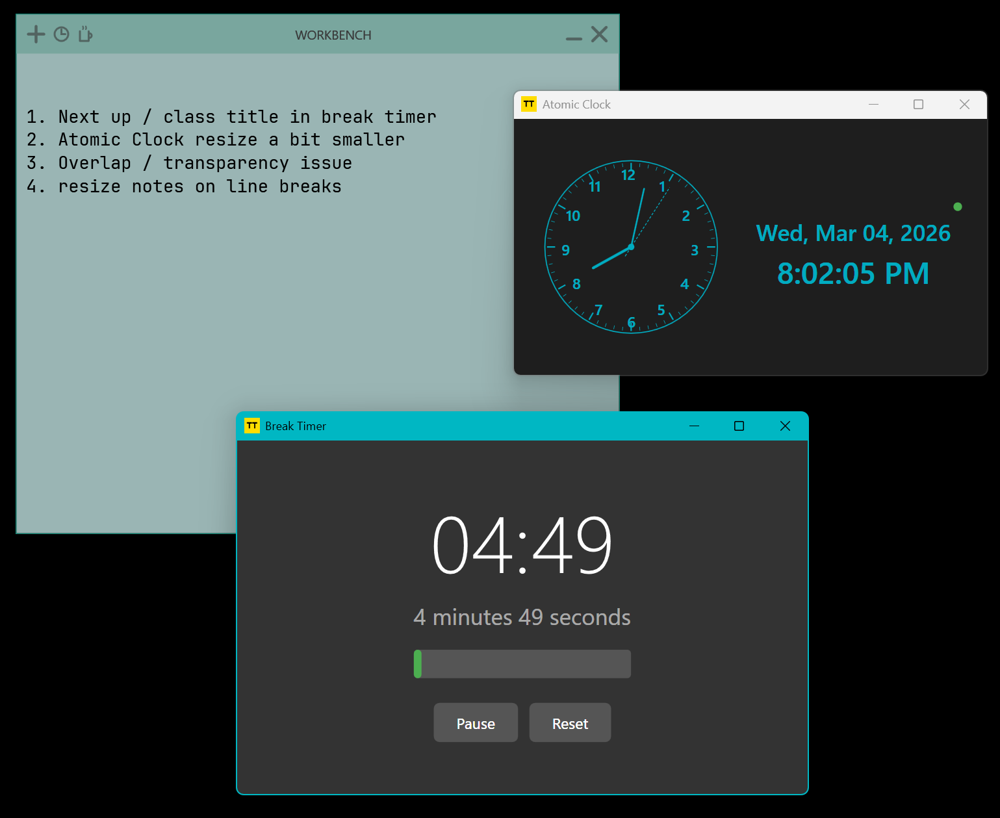
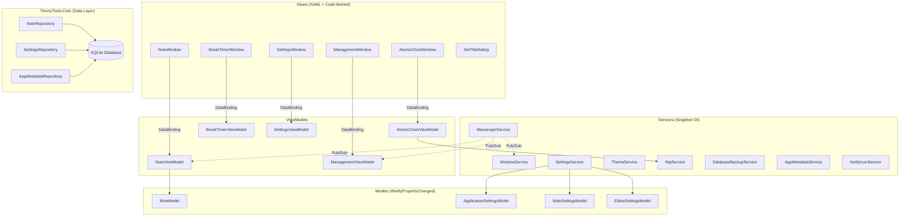
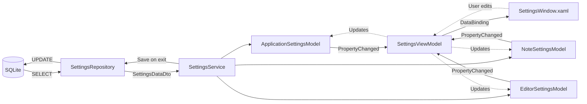
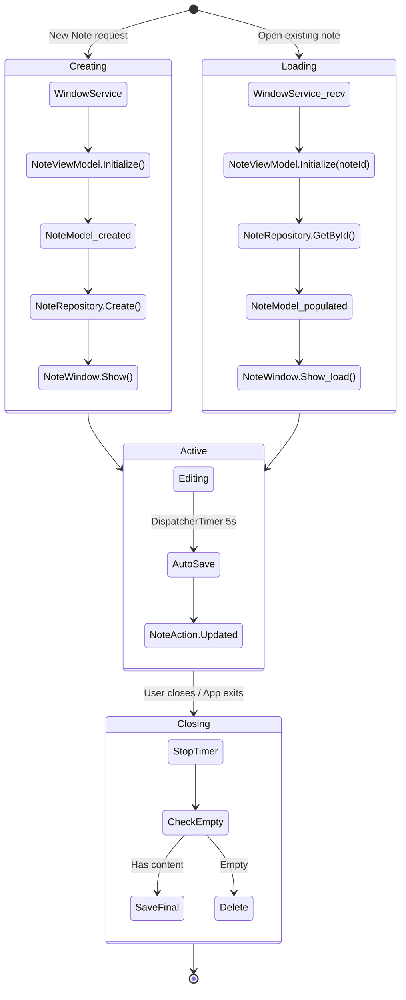

# Timmy Tools

[](https://www.gnu.org/licenses/old-licenses/gpl-2.0.en.html)
[](https://github.com/timothywarner-org/TimmyTools)
[](https://dotnet.microsoft.com/)

**Timmy Tools** is Tim Warner's teaching sidecar app -- a Windows desktop utility designed to run alongside his technical training courses. It combines persistent rich-text sticky notes, an NTP-synced analog/digital atomic clock, and a configurable break timer with class tracking -- all accessible from one system tray icon.

<p align="center">
  
</p>

---

## Quick Start

```bash
# Clone and build
git clone https://github.com/timothywarner-org/PinnyNotes.git
cd PinnyNotes
dotnet build TimmyTools.sln

# Run
dotnet run --project TimmyTools.WpfUi
```

**Prerequisites:** [.NET 10.0 SDK](https://dotnet.microsoft.com/download/dotnet/10.0) (Windows only -- WPF does not support Linux or macOS)

---

## Table of Contents

- [Tools Overview](#tools-overview)
- [Quick Tutorial](#quick-tutorial)
- [Sticky Notes Features](#sticky-notes-features)
- [Atomic Clock](#atomic-clock)
- [Break Timer](#break-timer)
- [Context Menu Tools](#context-menu-tools)
- [Settings](#settings)
- [Installation](#installation)
- [Building from Source](#building-from-source)
- [Project Structure](#project-structure)
- [Architecture](#architecture)
- [Technical Details](#technical-details)
- [Attribution](#attribution)
- [License](#license)

---

## Tools Overview

Timmy Tools includes three integrated utilities, all accessible from the system tray or directly from a note's title bar:

| Tool | Description |
|------|-------------|
| **Sticky Notes** | Pin-to-top rich-text notes with auto-save, color themes, dark mode, transparency, window shade, auto-resize, and a full formatting context menu |
| **Atomic Clock** | NTP-synced analog and digital clock display with sync status indicator |
| **Break Timer** | Countdown timer with presets (5/10/30/45 min), custom durations, class title, and "next up" tracking fields |

---

## Quick Tutorial

### 1. Launch the app

Run Timmy Tools from the Start Menu, desktop shortcut, or command line. A sticky note appears on screen and a system tray icon is added.

### 2. Create and manage notes

- **New note**: Click the `+` button on any note's title bar, or right-click the tray icon and select **New Note**.
- **Set a title**: Right-click the title bar and choose **Set Title**.
- **Roll up / Window shade**: Double-click the title bar to collapse a note to just its title bar. Double-click again to restore.
- **Auto-resize**: Notes automatically expand or shrink vertically as you type.
- **Pin on top**: Notes are always-on-top by default. Use settings to change this.
- **Format text**: Right-click inside the note for font, size, style, color, alignment, lists, and case transforms.
- **Save to file**: Right-click the title bar and choose **Save** to export as RTF or TXT.

### 3. Open the atomic clock

Click the clock icon on any note's title bar. The window shows an analog clock face and digital readout, synchronized with NTP time servers. A green dot means the clock is synced; red means it's using local time.

### 4. Start a break timer

Click the timer icon on any note's title bar. Choose a preset duration or enter a custom time. Use the **Class** and **Next Up** fields to display what you're teaching and what's coming after the break. The window turns green when the break is over.

### 5. Manage all notes

Left-click the system tray icon to open the **Management Window**, which shows a grid of all saved notes with color-coded previews. Open, close, or delete notes in bulk from here.

---

## Sticky Notes Features

### Note Management

- **Pin / Always on Top** -- Keep notes visible above all other windows.
- **Auto-Save** -- Notes are automatically saved every 5 seconds and on close.
- **Auto-Resize** -- Note height adjusts automatically as content grows or shrinks.
- **Window Shade / Roll-Up** -- Double-click the title bar to collapse a note to just its title bar; double-click again to restore.
- **Note Titles** -- Assign custom titles for easy identification.
- **Block Minimizing** -- Prevent notes from being minimized, even with Show Desktop.
- **Lock Text** -- Make a note read-only to prevent accidental edits.
- **Cascading New Notes** -- Child notes cascade from the parent, with collision detection (up to 50 positions checked).

### Title Bar Buttons

| Button | Action |
|--------|--------|
| `+` | Create a new sibling note |
| Clock icon | Open the Atomic Clock window |
| Timer icon | Open the Break Timer window |
| `_` | Minimize |
| `X` | Close (deletes note if empty) |

### Appearance

- **Color Themes** -- Choose from multiple color schemes or cycle through them automatically.
- **Dark Mode** -- Dark theme with color-matched accents; also supports Auto (follows Windows theme).
- **Transparency** -- Configurable opacity with modes: always transparent, opaque when focused, or disabled.
- **Start Position** -- Configure where on screen new notes appear (9-point grid).
- **Title Bar Auto-Hide** -- Title bar fades out when the note loses focus and the mouse leaves.

### Editor

- **Spell Checking** -- Integrated spell checker with right-click suggestions.
- **Auto Indent** -- New lines automatically match the indentation of the previous line.
- **Tab Indentation** -- Indent selected text with Tab; configurable spaces vs. tabs and tab width (1-16).
- **Word Wrap** -- Toggle text wrapping on or off.
- **New Line at End** -- Optionally ensure notes always end with a newline.
- **Line / Word / Character Counts** -- View counts for selected or full text from the context menu.

### Clipboard and Selection

- **Copy/Paste Trim** -- Automatically trim whitespace when copying or pasting.
- **Middle Click Paste** -- Paste clipboard contents with a middle-click.
- **Ctrl+Click Copy** -- Hold Ctrl and click to copy selected text.
- **Auto Copy** -- Automatically copy text when highlighted.
- **Configurable Copy Fallback** -- Choose behavior when no text is selected (current line, full note, or nothing).
- **Triple-Click** -- Select the current line.
- **Quadruple-Click** -- Select the full line ignoring wrapping.

### System Integration

- **System Tray Icon** -- Launch new notes, open management, access settings, or exit from the tray.
- **Taskbar/Task Switcher Visibility** -- Show or hide notes from Taskbar and Alt+Tab.
- **Single Instance** -- Only one instance runs; launching again creates a new note in the existing instance.
- **Multi-Monitor Support** -- Full support for multiple displays via Win32 interop.
- **Portable Mode** -- Place a `portable.txt` file next to the executable to store data locally instead of in AppData.

---

## Atomic Clock

The Atomic Clock window provides a precise, NTP-synchronized time display with both analog and digital readouts.

| Feature | Details |
|---------|---------|
| **Analog clock face** | Hour, minute, and second hands with smooth 50ms refresh |
| **Digital readout** | Full date and 12-hour time with seconds |
| **NTP sync** | Queries time.nist.gov, pool.ntp.org, time.google.com, and time.windows.com |
| **Sync interval** | Re-syncs every 10 minutes automatically |
| **Status indicator** | Green dot = synced, red dot = using local time |
| **Resizable** | Scales from 200x150 up to full screen via Viewbox |
| **Protocol** | RFC 1305 NTP v4 with leap indicator and stratum validation |

---

## Break Timer

The Break Timer is designed for pacing training sessions with clear visual feedback.

| Feature | Details |
|---------|---------|
| **Presets** | 5, 10, 30, and 45 minute quick-start buttons |
| **Custom duration** | Enter any duration from 1 to 999 minutes |
| **Class field** | Text input to display the current class or session title |
| **Next Up field** | Text input to show what's coming after the break |
| **Countdown display** | Large MM:SS (or H:MM:SS) with verbose "X minutes Y seconds" text |
| **Progress bar** | Visual green progress indicator |
| **Pause / Resume** | Pause the countdown and resume where you left off |
| **Completion indicator** | Window background turns green and displays "Break Over" |

---

## Context Menu Tools

Right-click inside any note for the full formatting and transformation menu:

| Menu | Actions |
|------|---------|
| **Font** | Segoe UI, Arial, Calibri, Consolas, Courier New, Times New Roman |
| **Size** | 8, 10, 12, 14, 16, 18, 20, 24, 28, 36 |
| **Style** | Bold, Italic, Underline, Clear Formatting |
| **Case** | Lower, Upper, Title |
| **Font Color** | Black, Red, Blue, Green, Orange, Purple, Brown, Gray |
| **Paragraph** | Left/Center/Right/Justified alignment, Bullets, Numbered, Lettered lists, Tab spacing |
| **Counts** | Line count, Word count, Character count |
| **Locked** | Toggle read-only mode |

Additional context menu features include Undo/Redo, Copy/Cut/Paste, Select All, and inline spelling suggestions.

### Keyboard Shortcuts

| Shortcut | Action |
|----------|--------|
| `Ctrl+B` | Toggle Bold |
| `Ctrl+I` | Toggle Italic |
| `Ctrl+U` | Toggle Underline |
| `Ctrl+C` | Copy (configurable behavior) |
| `Ctrl+V` | Paste (configurable behavior) |
| `Tab` | Indent selected text |

---

## Settings

Access settings from the title bar context menu or the system tray. Settings are organized into three tabs:

### Application

- Show tray icon
- Check for updates on startup

### Notes

- Default note size (width x height)
- Startup position (9-point grid)
- Minimize behavior (prevent or allow)
- Taskbar/task-switcher visibility
- Hide title bar option
- Color theme cycling, color mode (Light / Dark / Auto)
- Transparency mode and opacity values

### Editor

- Spell checker, word wrap, new line at end
- Font family (standard and mono) with mono font toggle
- Caret thickness and color (9 color options)
- Auto indent, tab vs. spaces, tab width
- 14 configurable copy/paste behaviors with trim options
- Middle-click paste and auto-copy toggles

---

## Installation

> **Windows only.** Timmy Tools is built with WPF, which does not support Linux or macOS.

### Installer

1. Go to the [Releases page](https://github.com/timothywarner-org/PinnyNotes/releases).
2. Download the latest `.msi` installer and run it.

### Portable

1. Download the latest `.zip` from the [Releases page](https://github.com/timothywarner-org/PinnyNotes/releases).
2. Extract it anywhere and run `Timmy Tools.exe`.
3. Data is stored next to the executable (no AppData usage).

---

## Building from Source

**Prerequisites:** [.NET 10.0 SDK](https://dotnet.microsoft.com/download/dotnet/10.0) (or later)

```bash
# Clone the repository
git clone https://github.com/timothywarner-org/PinnyNotes.git
cd PinnyNotes

# Build the solution
dotnet build TimmyTools.sln

# Run the application
dotnet run --project TimmyTools.WpfUi

# Build a release configuration
dotnet build TimmyTools.sln -c Release
```

> **Note:** The `TimmyTools.Setup` project is a Visual Studio Installer project (`.vdproj`) and does not build from the CLI. It requires Visual Studio with the Installer Projects extension.

---

## Project Structure

```
TimmyTools/
├── TimmyTools.sln                      # Solution file (3 projects)
├── CLAUDE.md                           # AI assistant project context
├── .editorconfig                       # Code style rules (explicit types, Allman braces)
│
├── assets/                             # Repository assets
│   └── icon.svg                        #   Source icon file
│
├── images/                             # Screenshots
│   └── timmytools.png                  #   Application screenshot
│
├── docs/                               # Architecture documentation
│   ├── architecture.svg                #   High-level MVVM diagram
│   ├── settings-pipeline.svg           #   Settings data flow diagram
│   └── note-lifecycle.svg              #   Note state machine diagram
│
├── TimmyTools.Core/                    # DATA LAYER (class library, net10.0)
│   ├── TimmyTools.Core.csproj          #   Depends on: Microsoft.Data.Sqlite
│   ├── DatabaseInitializer.cs          #   Creates DB schema, runs migrations
│   ├── Configurations/
│   │   └── DatabaseConfiguration.cs    #   Connection string + path resolution
│   ├── DataTransferObjects/
│   │   ├── NoteDto.cs                  #   Note data record (immutable)
│   │   ├── SettingsDataDto.cs          #   Settings data record (immutable)
│   │   └── AppMetadataDataDto.cs       #   App metadata record (immutable)
│   ├── Enums/                          #   Shared enumerations (14 enum files)
│   ├── Migrations/                     #   Sequential schema migrations (v1-v6)
│   └── Repositories/
│       ├── _BaseRepository.cs          #   Shared SQLite helpers
│       ├── NoteRepository.cs           #   CRUD for notes
│       ├── SettingsRepository.cs       #   CRUD for settings
│       └── AppMetadataRepository.cs    #   CRUD for app metadata
│
├── TimmyTools.WpfUi/                   # UI LAYER (WPF executable, net10.0-windows)
│   ├── TimmyTools.WpfUi.csproj         #   Depends on: Core, H.NotifyIcon.Wpf, MS DI
│   ├── App.xaml / App.xaml.cs           #   Entry point, DI registration, single-instance
│   ├── Views/                           #   WPF Windows (XAML + code-behind)
│   │   ├── NoteWindow.xaml/.cs          #     Sticky note (shade, auto-resize, title bar buttons)
│   │   ├── AtomicClockWindow.xaml/.cs   #     NTP-synced analog/digital clock
│   │   ├── BreakTimerWindow.xaml/.cs    #     Countdown timer with class tracking
│   │   ├── SettingsWindow.xaml/.cs      #     3-tab settings dialog
│   │   ├── ManagementWindow.xaml/.cs    #     Note grid with bulk operations
│   │   └── SetTitleDialog.xaml/.cs      #     Note title input dialog
│   ├── ViewModels/                      #   MVVM ViewModels
│   ├── Models/                          #   Observable models (INotifyPropertyChanged)
│   ├── Services/                        #   Application services (DI singletons)
│   ├── Messages/                        #   Typed pub/sub message records
│   ├── Commands/                        #   RelayCommand ICommand implementation
│   ├── Controls/                        #   Custom WPF controls (RichTextBox, context menu)
│   ├── Helpers/                         #   Screen, theme, and version utilities
│   ├── Interop/                         #   Win32 P/Invoke (User32, constants, structures)
│   ├── Themes/                          #   Color schemes and palette management
│   └── Images/                          #   App icon (ico + png)
│
└── TimmyTools.Setup/                    # MSI INSTALLER (Visual Studio .vdproj)
                                         #   Does not build from CLI
```

---

## Architecture

Timmy Tools follows the **MVVM (Model-View-ViewModel)** pattern with a **pub/sub messaging** layer for decoupled communication between components. All services are registered through **Microsoft.Extensions.DependencyInjection** in `App.xaml.cs`.

### High-Level Architecture

The application is split into two projects: **TimmyTools.Core** (data layer) and **TimmyTools.WpfUi** (UI layer). Views bind to ViewModels, ViewModels communicate through `MessengerService`, and all data persistence flows through the repository pattern to SQLite.

<p align="center">
  
</p>

<details>
<summary>View Mermaid source</summary>


```mermaid
graph TB
    subgraph Views["Views (XAML + Code-Behind)"]
        NW[NoteWindow]
        ACW[AtomicClockWindow]
        BTW[BreakTimerWindow]
        SW[SettingsWindow]
        MW[ManagementWindow]
        STD[SetTitleDialog]
    end

    subgraph ViewModels["ViewModels"]
        NVM[NoteViewModel]
        ACVM[AtomicClockViewModel]
        BTVM[BreakTimerViewModel]
        SVM[SettingsViewModel]
        MVM[ManagementViewModel]
    end

    subgraph Models["Models (INotifyPropertyChanged)"]
        NM[NoteModel]
        ASM[ApplicationSettingsModel]
        NSM[NoteSettingsModel]
        ESM[EditorSettingsModel]
    end

    subgraph Services["Services (Singleton DI)"]
        WS[WindowService]
        SS[SettingsService]
        MS[MessengerService]
        TS[ThemeService]
        NTP[NtpService]
        DBS[DatabaseBackupService]
        AMS[AppMetadataService]
        NIS[NotifyIconService]
    end

    subgraph Core["TimmyTools.Core (Data Layer)"]
        NR[NoteRepository]
        SR[SettingsRepository]
        AMR[AppMetadataRepository]
        DB[(SQLite Database)]
    end

    NW -->|DataBinding| NVM
    ACW -->|DataBinding| ACVM
    BTW -->|DataBinding| BTVM
    SW -->|DataBinding| SVM
    MW -->|DataBinding| MVM
    NVM --> NM
    ACVM --> NTP
    SS --> ASM & NSM & ESM
    MS -.->|Pub/Sub| WS & NVM & MVM
    NR & SR & AMR --> DB
```

</details>

### Settings Pipeline

Settings flow from SQLite through the repository layer as immutable DTOs, get mapped into three observable model objects by `SettingsService`, bind to ViewModels, and render in XAML. Changes flow back through the same pipeline on application exit.

<p align="center">
  
</p>

<details>
<summary>View Mermaid source</summary>


```mermaid
flowchart LR
    DB[(SQLite)] -->|SELECT| SR[SettingsRepository]
    SR -->|SettingsDataDto| SS[SettingsService]
    SS --> ASM[ApplicationSettingsModel] & NSM[NoteSettingsModel] & ESM[EditorSettingsModel]
    ASM & NSM & ESM -->|PropertyChanged| SVM[SettingsViewModel]
    SVM -->|DataBinding| SWX[SettingsWindow.xaml]
    SWX -.->|User edits| SVM -.->|Updates| ASM & NSM & ESM
    SS -->|Save on exit| SR -->|UPDATE| DB
```

</details>

### Note Lifecycle

A note progresses through creation (or loading), an active editing state with periodic auto-save, and finally closing where it is either saved or deleted if empty.

<p align="center">
  
</p>

<details>
<summary>View Mermaid source</summary>


```mermaid
stateDiagram-v2
    [*] --> Creating: New Note request
    [*] --> Loading: Open existing note

    state Creating {
        WindowService --> NoteViewModel.Initialize()
        NoteViewModel.Initialize() --> NoteModel_created
        NoteModel_created --> NoteRepository.Create()
        NoteRepository.Create() --> NoteWindow.Show()
    }

    state Loading {
        WindowService_recv --> NoteViewModel.Initialize(noteId)
        NoteViewModel.Initialize(noteId) --> NoteRepository.GetById()
        NoteRepository.GetById() --> NoteModel_populated
        NoteModel_populated --> NoteWindow.Show_load()
    }

    Creating --> Active
    Loading --> Active

    state Active {
        Editing --> AutoSave: DispatcherTimer 5s
        AutoSave --> NoteAction.Updated
    }

    Active --> Closing: User closes / App exits

    state Closing {
        StopTimer --> CheckEmpty
        CheckEmpty --> SaveFinal: Has content
        CheckEmpty --> Delete: Empty
    }

    Closing --> [*]
```

</details>

---

## Technical Details

| Aspect | Details |
|--------|---------|
| **Framework** | .NET 10.0, WPF (Windows Presentation Foundation) |
| **Language** | C# with nullable reference types enabled |
| **Database** | SQLite via Microsoft.Data.Sqlite |
| **DI Container** | Microsoft.Extensions.DependencyInjection |
| **Tray Icon** | H.NotifyIcon.Wpf |
| **Schema Version** | 6 (with 5 sequential migrations from v1) |
| **Data Location** | `%APPDATA%/Pinny Notes/pinny_notes.sqlite` (installed) or exe directory (portable/debug) |
| **Single Instance** | Named Mutex + EventWaitHandle with separate GUIDs for Debug/Release |
| **Win32 Interop** | P/Invoke to User32 for window positioning, always-on-top, and visibility control |
| **NTP Protocol** | RFC 1305 v4 with 4 fallback servers and 10-minute sync interval |

### Service Registration Summary

Configured in `App.xaml.cs`:

| Lifetime | Services |
|----------|----------|
| **Singleton** | `DatabaseConfiguration`, `SettingsRepository`, `AppMetadataRepository`, `NoteRepository`, `AppMetadataService`, `SettingsService`, `MessengerService`, `WindowService`, `ThemeService`, `DatabaseBackupService`, `NtpService` |
| **Transient** | `NotifyIconService`, `SettingsWindow`, `SettingsViewModel`, `ManagementWindow`, `ManagementViewModel`, `BreakTimerWindow`, `BreakTimerViewModel`, `AtomicClockWindow`, `AtomicClockViewModel` |

---

## Attribution

Timmy Tools builds on the work of several projects and inspirations:

- **[PinnyNotes](https://github.com/63BeetleSmurf/PinnyNotes)** by 63BeetleSmurf -- The original sticky notes application that Timmy Tools was forked from. PinnyNotes provided the core note management, text transformation tools, and MVVM architecture that form the foundation of this project.
- **Atomic Clock** -- The NTP-synced clock window was inspired by the need to display precise, server-synchronized time during live training sessions.
- **Break Timer** -- The break timer concept draws from classic egg timer utilities, adapted here as a training break countdown with class tracking for pacing course sessions.

---

## License

This project is licensed under the [GNU General Public License v2.0](https://www.gnu.org/licenses/old-licenses/gpl-2.0.en.html).
